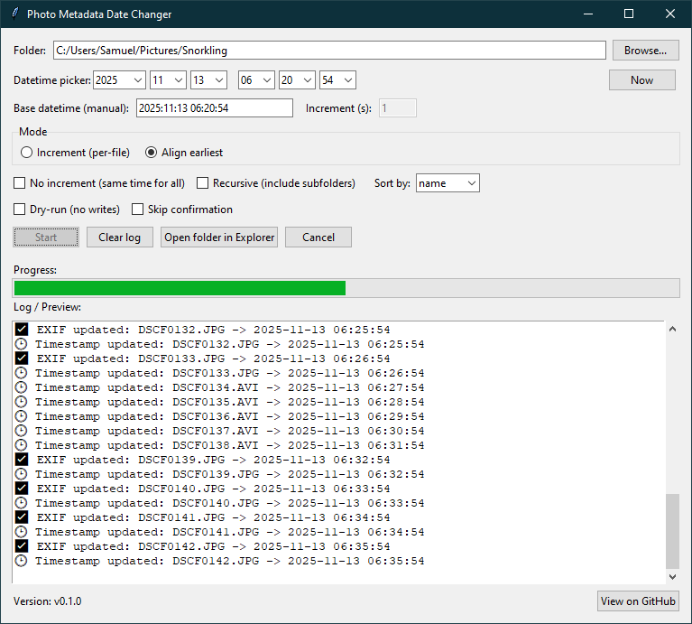

# 📸 Photo Metadata Date Changer

A Python tool that updates **EXIF metadata** (for JPEGs) and **filesystem timestamps** for all files in a given folder.
It supports incremental timestamps, aligning photo times based on the earliest photo, recursive processing, and GUI/CLI modes.

## Interface Options

### Graphical Interface

Launch the GUI via:

```bash
python main.py --gui
```

> [!NOTE]
> Releases are also built as a standalone `.exe` that can be downloaded from the `./release` folder (e.g. `PhotoMetadataDateChanger_v0.1.0.exe`).

### Command-Line Mode

Run via:

```bash
python main.py [OPTIONS]
```

**Example GUI startup window:**

<p align="center">
  
</p>

## Quick Reference

| Use Case                    | Example Command                                                                | Description                                                                          |
| --------------------------- | ------------------------------------------------------------------------------ | ------------------------------------------------------------------------------------ |
| Preview changes (no writes) | `python main.py --dry-run -f "C:\Photos"`                                      | Safe preview without modifying any files                                             |
| Increment timestamps        | `python main.py --datetime "2025:11:03 11:45:00" -i 2 -f "C:\Photos"`          | Adds +2s between each file, starting from given date                                 |
| Align earliest photo        | `python main.py --mode align-earliest -d "2025:11:03 11:45:00" -f "C:\Photos"` | Keeps relative spacing between photos, shifts all so the earliest matches given date |
| Recursive processing        | `python main.py -r -y -f "D:\AllAlbums"`                                       | Processes subfolders too (no prompt)                                                 |
| Fixed time (no increment)   | `python main.py --no-increment -y -d "2024:12:31 23:59:00" -f "C:\DCIM"`       | Sets all photos to exactly the same timestamp                                        |
| Full auto run               | `python main.py --mode align-earliest -r -y -f "E:\CameraDump"`                | Recursive + align-earliest + skip confirmation                                       |

## GUI Overview

The GUI offers an interface with:

- Folder selector
- Datetime picker
- Options for mode (`increment` / `align-earliest`)
- Sorting, recursion, dry-run toggles
- Progress bar and logging console
- Safe cancel operation (via background threading)
- Tooltips for all fields that provide helpful descriptions

**Example run in GUI:**

<p align="center">
  
</p>

## Features

- Update **EXIF DateTimeOriginal**, **DateTimeDigitized**, and **DateTime** for `.jpg` / `.jpeg`
- Update filesystem **modified/access** timestamps
- Increment timestamps for ordered photo sequences
- Align timestamps while preserving relative differences
- Optional recursive mode
- **Dry-run mode** for verification
- **Graphical interface** for non-CLI users

## Installation

Make sure you have Python 3.8+ and `pip` installed (can follow [this guide](https://packaging.python.org/en/latest/tutorials/installing-packages/) if needed).

```bash
git clone https://github.com/estes-sj/photo-metadata-date-changer
cd photo-metadata-date-changer
pip install -r requirements.txt
```

Then launch the GUI via:

```bash
python main.py --gui
```

or use the command-line interface via the arguments below.

## Command-Line Arguments

| Argument                    | Type  | Default               | Description                                                   |
| --------------------------- | ----- | --------------------- | ------------------------------------------------------------- |
| `--folder`, `-f`            | `str` | _(required)_          | Folder path containing photos.                                |
| `--datetime`, `-d`          | `str` | `YYYY:MM:DD HH:MM:SS` | Base datetime to apply.                                       |
| `--increment-seconds`, `-i` | `int` | `1`                   | Seconds to add per file in `increment` mode.                  |
| `--no-increment`            | flag  | -                     | Use same timestamp for all files.                             |
| `--recursive`, `-r`         | flag  | -                     | Include subfolders.                                           |
| `--sort-by`                 | `str` | `name`                | Sorting method for `increment` mode (`name` or `mtime`).      |
| `--mode`                    | `str` | `increment`           | How timestamps are applied (`increment` or `align-earliest`). |
| `--yes`, `-y`               | flag  | -                     | Skip confirmation prompt.                                     |
| `--dry-run`                 | flag  | -                     | Preview without writing changes.                              |
| `--gui`                     | flag  | -                     | Launch the GUI instead of CLI.                                |

## Modes Explained

### `increment` (default)

Each file gets a slightly later timestamp, starting from your base time.

| File       | New Time            |
| ---------- | ------------------- |
| photo1.jpg | 2025:11:03 11:45:00 |
| photo2.jpg | 2025:11:03 11:45:01 |
| photo3.jpg | 2025:11:03 11:45:02 |

### `align-earliest`

Keeps relative spacing between files but aligns the earliest one to the given datetime.

| File       | Original Time       | New Time            |
| ---------- | ------------------- | ------------------- |
| photo1.jpg | 2023:08:14 09:31:45 | 2025:11:03 11:45:00 |
| photo2.jpg | +00:00:10 later     | 2025:11:03 11:45:10 |

## Examples

### Example 1 - Dry Run (Increment Mode)

```bash
python main.py --folder "C:\Photos\BeachTrip" --datetime "2025:11:03 11:45:00" --increment-seconds 2 --dry-run
```

**Output (trimmed):**

```bash
Found 4 file(s) in `C:\Photos\BeachTrip`.
  - beach_001.jpg
  - beach_002.jpg
  - beach_003.jpg
  - beach_004.jpg

Mode: increment. Apply datetime = 2025-11-03 11:45:00 (dry-run)? (y/n): y

🔍 [Dry-run] Would update EXIF for beach_001.jpg -> 2025-11-03 11:45:00
🔍 [Dry-run] Would set timestamp for beach_001.jpg -> 2025-11-03 11:45:00
🔍 [Dry-run] Would update EXIF for beach_002.jpg -> 2025-11-03 11:45:02
🔍 [Dry-run] Would set timestamp for beach_002.jpg -> 2025-11-03 11:45:02
...

🔍 Dry-run complete. No files modified.
```

### Example 2 - Align Earliest Mode (Actual Run)

```bash
python main.py --mode align-earliest --datetime "2025:11:03 11:45:00" -y --folder "C:\Photos\Hike"
```

**Output (trimmed):**

```bash
Found 5 file(s) in `C:\Photos\Hike`.

Earliest file: IMG_103.jpg (2023-08-14 09:31:45)
Offset applied to all: 808 days, 2:13:15

✅ EXIF updated: IMG_101.jpg -> 2025-11-03 11:44:55
🕒 Timestamp updated: IMG_101.jpg -> 2025-11-03 11:44:55
✅ EXIF updated: IMG_102.jpg -> 2025-11-03 11:45:01
🕒 Timestamp updated: IMG_102.jpg -> 2025-11-03 11:45:01
...

✅ Done.
```

### Example 3 - Recursive Same-Time Update

```bash
python main.py -r --no-increment -y -d "2024:12:31 23:59:00" -f "D:\CameraDump"
```

Every file (in all subfolders) gets:

```
2024:12:31 23:59:00
```

## Tip: Always Start with Dry Run

Before doing an actual run, preview with:

```bash
python main.py --dry-run -f "C:\Photos"
```

You'll see exactly which timestamps would be changed - no files modified.
